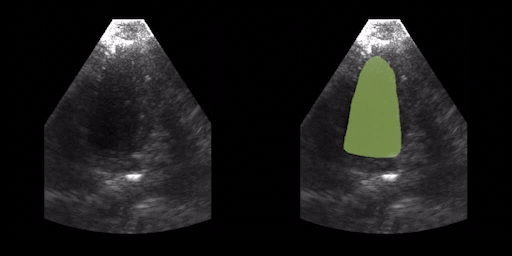

# Wearable-Cardiac-Ultrasound-Imager

## Code Availability
In the paper "A wearable cardiac ultrasound imager", we experimented with several state-of-art ML models to perform the task of automatic left ventricle segmentation. Specifically, we implemented the models based on open-source codes that are listed below:

| Model Name    | Code availability |
| ------------- | ------------- |
| UNET          | https://github.com/divamgupta/image-segmentation-keras  |
| FCN-32  | https://github.com/divamgupta/image-segmentation-keras  |
| FCN-8  | https://github.com/divamgupta/image-segmentation-keras  |
| Attention-UNET  | https://github.com/LeeJunHyun/Image_Segmentation |
| UNET++  | https://github.com/MrGiovanni/UNetPlusPlus  |
| FCN-8 VGG  | https://github.com/divamgupta/image-segmentation-keras  |
| UNET VGG  | https://github.com/divamgupta/image-segmentation-keras  |
| UNET Resnet50  | https://github.com/divamgupta/image-segmentation-keras  |

## Examples
The following video is an example of semantic segmentation on left ventricle images collected from a subject who has just finished an intense exercise, using FCN-32 which was the best-performing model in our experiments. 
 

